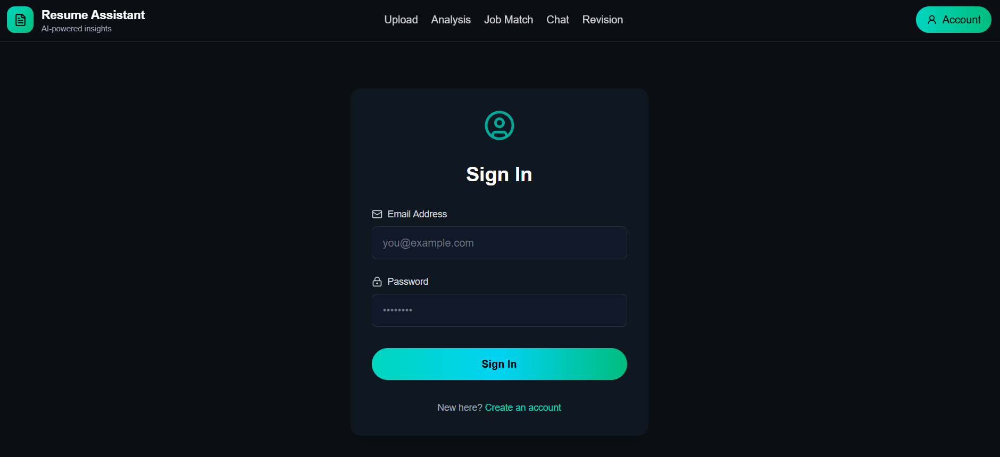
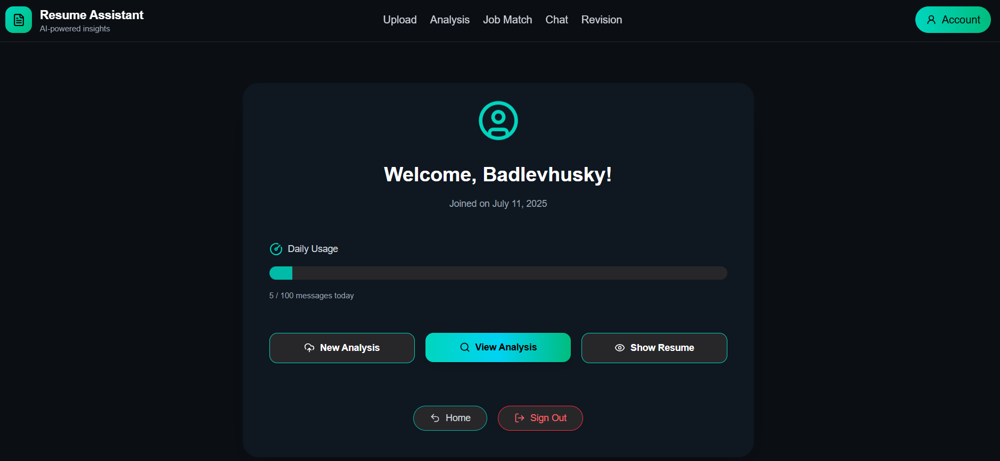
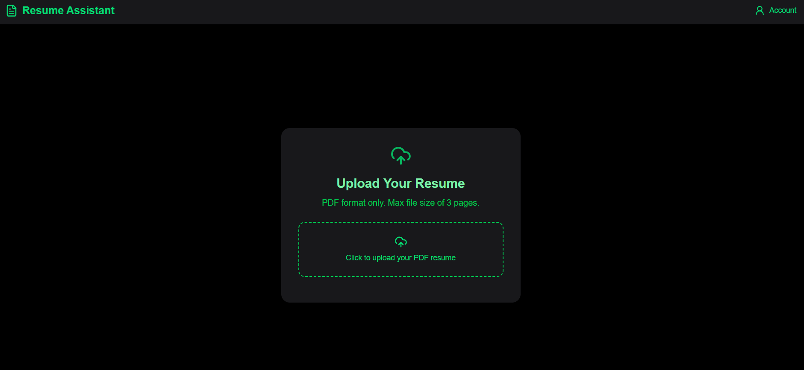
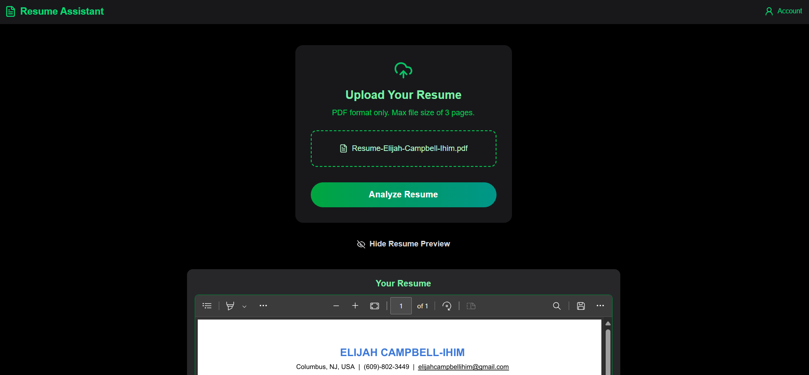
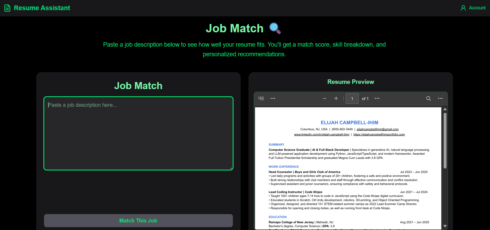
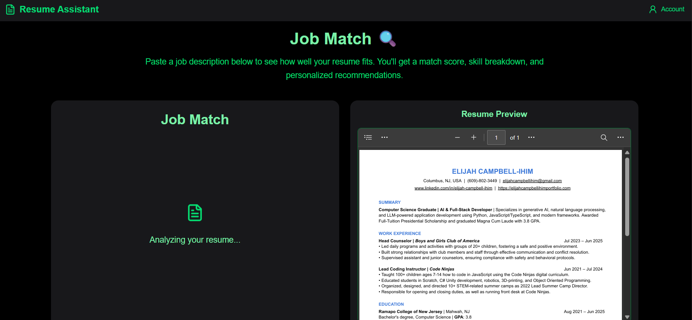
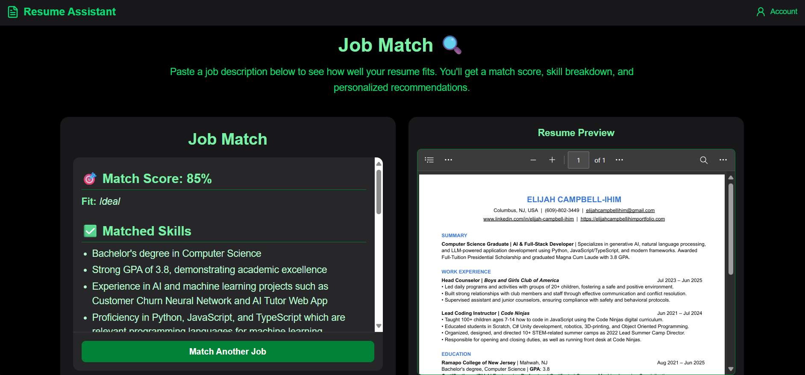
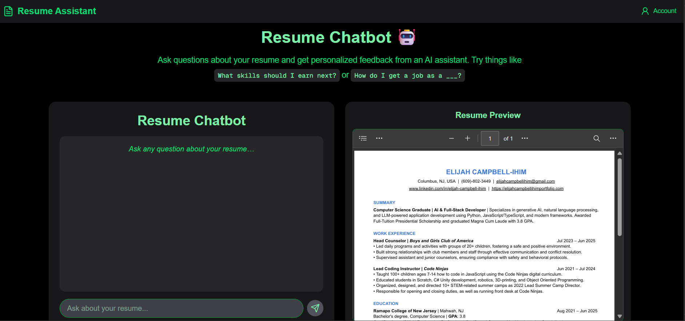
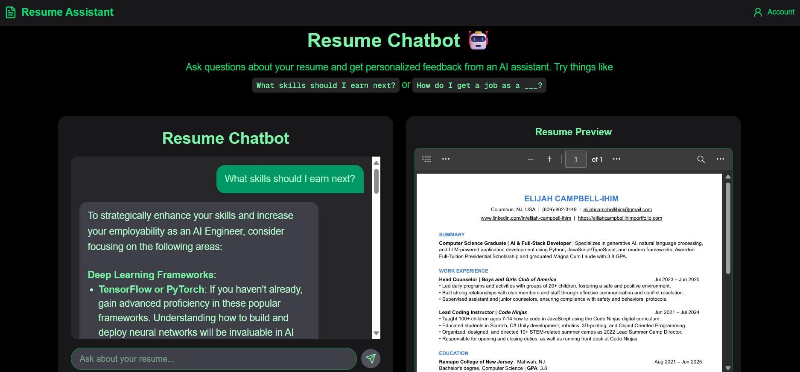

# 📗 Resume Assistant – Frontend

Frontend for the AI-powered resume analysis tool. Users can upload resumes, receive structured feedback, explore role matches, and ask targeted questions via a resume-aware chatbot.

Built with **Next.js**, styled with **Tailwind CSS**, and integrated with **Supabase** and **NextAuth**.


## 🎉 Live on Vercel  
👉 [Visit Resume Assistant!](https://resume-assistant.website)

---

## 🔍 Overview

- ✅ PDF upload and preview
- 📊 AI-driven feedback, organized by section
- 💼 Role suggestions tailored to resume content
- 💬 Chatbot trained on user's resume
- 🔐 Secure auth with Supabase + NextAuth
- 📁 Per-user resume memory and dashboard
- ⚡ Deployed via Vercel

---


## 🖼️ Screenshots

### 🏠 Home & Accounts

<div align="center">
  
  <p><em>Homepage</em></p>
</div>

<div align="center">
  
  <p><em>Sign in</em></p>
</div>

<div align="center">
  
  <p><em>Account</em></p>
</div>

---

### 📝 Upload

<div align="center">
  
  <p><em>Upload Interface</em></p>
</div>

<div align="center">
  
  <p><em>Upload Preview</em></p>
</div>

---

### 🏅 Analysis

<div align="center">
  
  <p><em>Resume Analysis</em></p>
</div>

<div align="center">
  
  <p><em>Multiple Sections</em></p>
</div>

---

### 👩‍💻 Job Match

<div align="center">
  
  <p><em>Paste Job Description</em></p>
</div>

<div align="center">
  
  <p><em>Analyzes Match</em></p>
</div>

<div align="center">
  
  <p><em>Custom Analysis</em></p>
</div>

---

### 💬 Chat

<div align="center">
  
  <p><em>Chat Interface</em></p>
</div>

<div align="center">
  
  <p><em>Send Message</em></p>
</div>

<div align="center">
  
  <p><em>Personalized Response</em></p>
</div>


---


## 🛠 Stack

- **Framework:** Next.js 14 (App Router)
- **Auth & DB:** Supabase + Supabase Adapter
- **Styling:** Tailwind CSS
- **Icons:** Lucide React
- **Deploy:** Vercel

---

## ⚙️ Local Setup

```bash
git clone https://github.com/your-username/resume-assistant-frontend
cd resume-assistant-frontend
npm install
cp .env.example .env.local
```

`.env.local` should include:

```
NEXT_PUBLIC_SUPABASE_URL=
NEXT_PUBLIC_SUPABASE_ANON_KEY=
NEXTAUTH_URL=http://localhost:3000
NEXTAUTH_SECRET=
```

Start the dev server:

```bash
npm run dev
```

Visit `http://localhost:3000`

---

## 🧭 Key Routes

| Path         | Description              |
|--------------|---------------------------|
| `/upload`    | Upload and preview resume |
| `/analysis`  | AI-generated feedback     |
| `/chatbot`   | Ask questions about resume|
| `/account`   | View usage + history      |

---

## 📁 File Structure

```
app/
├─ upload/
├─ analysis/
├─ chatbot/
├─ account/
components/
├─ ToolsNav.tsx
├─ MarkdownRenderer.tsx
```

---

## 🔗 Related Repositories

- [Frontend Repository](https://github.com/ECampbell37/Resume_Assistant_Frontend) – This repo
- [Backend Repository](https://github.com/ECampbell37/Resume_Assistant_Backend) – FastAPI service running on AWS ECS, managing AI-powered backend

---

## 👤 Author

Elijah Campbell-Ihim  
[elijahcampbellihimportfolio.com](https://elijahcampbellihimportfolio.com)
